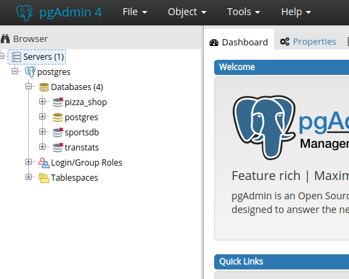
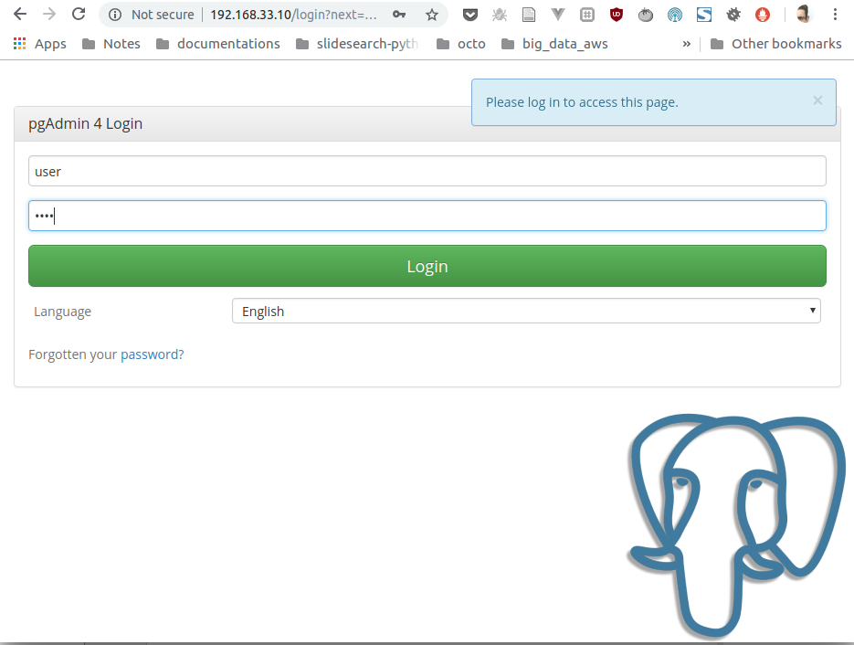
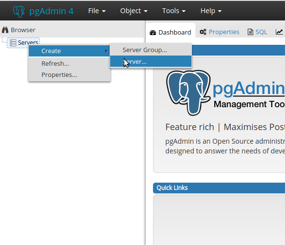
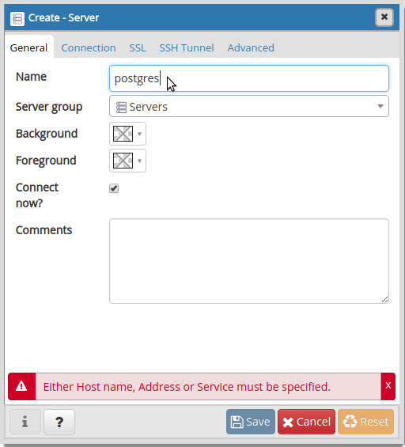
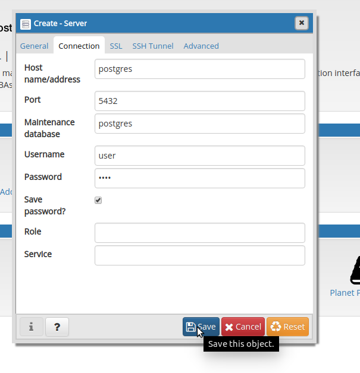

# Lab Postgres (revisité en urgence)

## General information
-----------------------

* [website](esme.farcellier.com)


## Intro
------------------------

This repository contains scripts to create a container that exposes databases we use
during classes:

* bio_icare_drone
* pizza_shop
* sportsdb
* transtats



## Requirements
---------------
### Installation to perform on your computer

You will need those softwares on your computer :

* [Docker](https://docs.docker.com/get-docker/)

Install process are in the upper link :)


### Step 1 : install the environment

1. clone this repository :

```
git clone https://github.com/luxcharmant/lab-postgresql-dockerize.git
```

To create the containers, build if necessary, use the command

    make postgres-up

This script will pull and run containers with postgresql and pgadmin, then load
the sample databases.

### Step 2 : configure pgadmin to use postgresql


1. connect on http://localhost:5050 with your browser



Here is the logging information to use :

* Utilisateur : user
* Mot de passe : user

[pgadmin](https://www.pgadmin.org/) is a GUI client for postgresql.

2. declare your postgresql database in pgadmin



2.1. write the display name in pgadmin



2.2. configure the server connection



Host Name : postgres
login : sudria
password: admin

That's normal if the picture is not up-to-date..

the Host Name is resolved through [user-defined-network on docker](https://docs.docker.com/v17.09/engine/userguide/networking/configure-dns/).

Step 3: use the database that match our practical work


## Useful commands

To down the containers, use the command

    make postgres-down

To force down the containers if pgadmin doesn't want to exit, use the command

    make postgres-down-force

To create the containers in background, build if necessary, use the command

    make postgres-up-bg

To logs postgres container, specially useful when starting postgres in background, use the command

    make postgres-logs